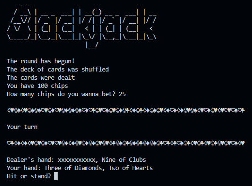
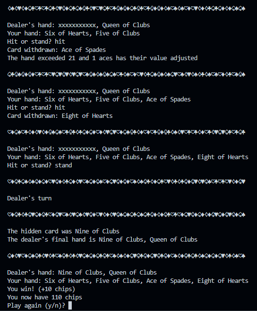
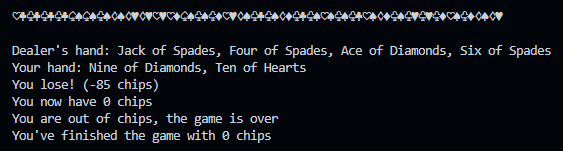

# Blackjack

Implementation of the game blackjack with a human player and the computer as a dealer, made while learning Python

- Only hit and stand moves are allowed
- The player begins with 100 chips
- The dealer hits until 17

---

---

---

