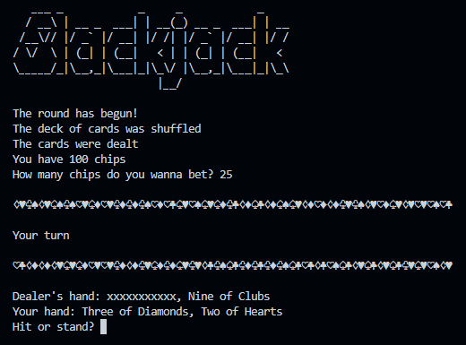
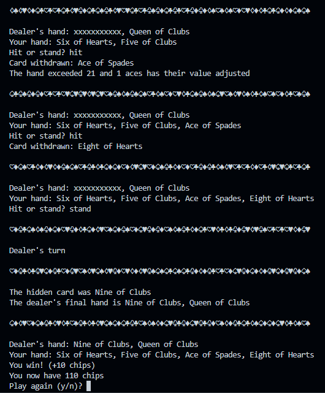
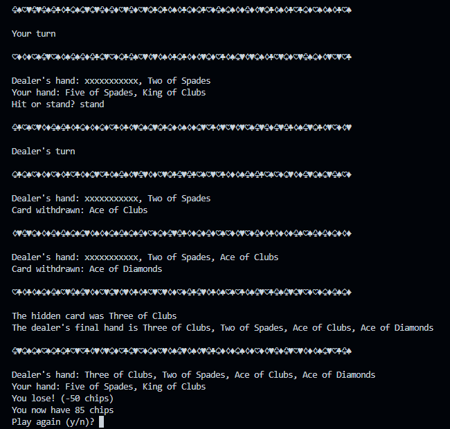
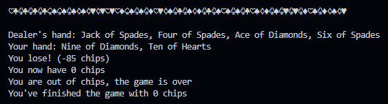
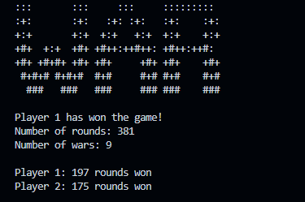
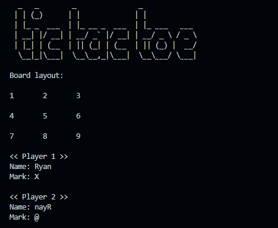
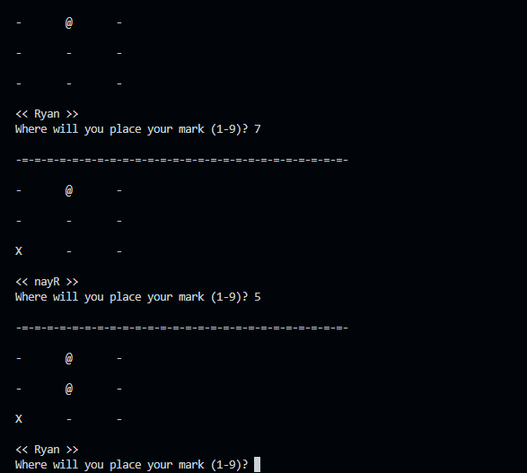
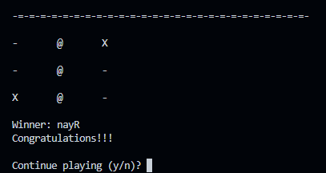

# Python Games

Games made while learning Python.

## Blackjack

Implementation of the game blackjack with a human player and the computer as a dealer.

- Only hit and stand moves are allowed
- The player begins with 100 chips
- The dealer hits until 17

---

---

---

## War Card Game

Simulation of the card game war that gives stats at the end of the match.

- All 52 cards are used
- The cards are shuffled only once, at the start of the match
- When war happens, each player withdraws 3 cards

## Tic-tac-toe

- The players can choose their own marks (instead of just X and O)
- Rematches allowed
- It indexes the board from 1 to 9 (left to right, top to bottom)

---

---

